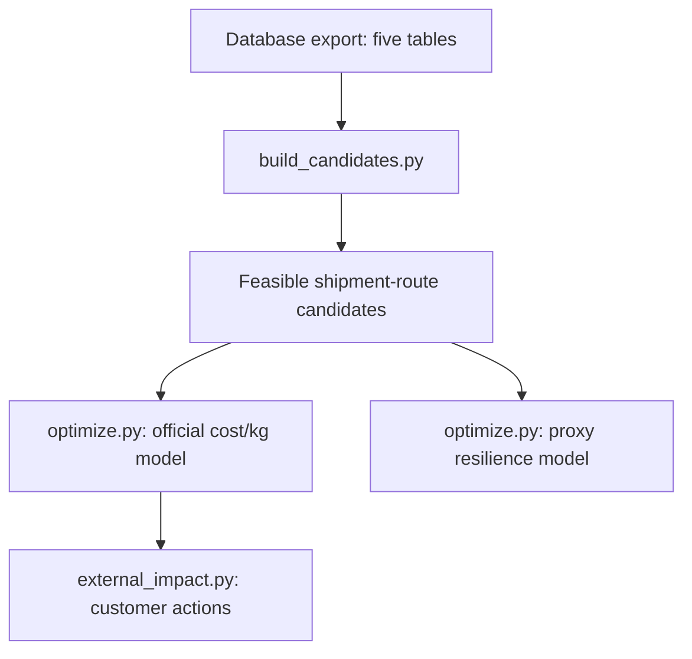

# Complete explanation of the optimiser

The optimiser has three main Python scripts:

1. `build_candidates.py` prepares all feasible shipment-route combinations.
2. `optimize.py` calculates the features, builds the PuLP model and selects routes.
3. `external_impact.py` converts the selected internal routes into delivery-level customer impacts.

There are two optimisation outputs:

* **Official model:** optimises the 40/40/20 MinScore using delivery-level cost/kg.
* **Proxy model:** optimises all 240 internal shipments using cost per piece for the resilience demonstration.



## 1. Input data

The optimiser uses five tables.

| Table                | Purpose                                                               |
| -------------------- | --------------------------------------------------------------------- |
| `Internal_Shipments` | Internal shipment demand, quantity, stage, family and shipment date   |
| `External Shipments` | External deliveries, chargeable weight and link to internal shipments |
| `Route_Options`      | Available routes, lead time, cost, risk and capacity                  |
| `Hub_Constraints`    | Hub capacity, utilization and handling capabilities                   |
| `Material_Families`  | Hazard, temperature and priority requirements                         |

The Python scripts currently read an Excel workbook, not Supabase directly. When database data is used, it must first be exported into the required sheet and column structure.

The workbook path can be provided using:

```bash
IFX_WORKBOOK=/path/to/workbook.xlsx
```

If the database changes, the workbook must be exported again before rerunning the optimiser.

---

# Stage 1: `build_candidates.py`

## Purpose

This script converts the normalized source tables into a flat candidate table.

One candidate row represents:

> One internal shipment using one possible route.

It does not select the winning route. It only constructs and filters the available choices.

## Step 1.1: Load the tables

The `load_sheets()` function loads:

* `Internal_Shipments`
* `Material_Families`
* `Route_Options`
* `Hub_Constraints`

The external-delivery table is used later by `optimize.py`.

## Step 1.2: Clean material requirements

Missing `HazardClass` values are replaced with `"None"`:

```python
M["HazardClass"] = M["HazardClass"].fillna("None")
```

This means that a missing value is treated as having no special hazard-handling requirement.

## Step 1.3: Correct the percentage fields

The following hub fields contain decimal fractions:

* `CurrentUtilizationPct = 0.35` means 35%
* `MaxUtilizationPct = 0.90` means 90%
* `CapacityReductionPct = 0.25` means 25%

They are renamed to make this clear:

```text
CurrentUtilizationPct → current_utilization_ratio
MaxUtilizationPct → max_utilization_ratio
CapacityReductionPct → capacity_reduction_ratio
```

They are not divided by 100.

## Step 1.4: Calculate remaining hub capacity

For every hub:

```text
Capacity Ceiling  = Weekly Capacity × Maximum Utilization × (1 − Capacity Reduction)
Current Load      = Weekly Capacity × Current Utilization
Remaining Capacity = max(0, Capacity Ceiling − Current Load)
```

In code:

```python
ceiling = WeeklyCapacityUnits * (
    max_utilization_ratio * (1 - capacity_reduction_ratio)
)
current_load = (
    WeeklyCapacityUnits * current_utilization_ratio
)
remaining_capacity_units = max(0, ceiling - current_load)
```

### Example

Suppose a hub has:

* Weekly capacity: 10,000 units
* Maximum utilization: 90%
* Current utilization: 50%
* Disruption reduction: 20%

Then:

```text
Ceiling            = 10,000 × 0.9 × (1 − 0.2) = 7,200
Current Load       = 10,000 × 0.5             = 5,000
Remaining Capacity = 7,200 − 5,000            = 2,200
```

The optimiser can therefore allocate another 2,200 units through this hub.

## Step 1.5: Join internal shipments to material requirements

The first join is:

```text
Internal_Shipments
        ↓ MaterialNo_Anon
Material_Families
```

It adds:

* `HazardClass`
* `TempRequirement`
* `PriorityClass`

to every internal shipment.

These fields determine whether the origin and destination hubs can handle the material.

## Step 1.6: Filter the route menu

The route table is filtered using:

```python
DisruptionScenario == active_scenario
AvailableFlag == "Yes"
```

The available scenarios are:

* `Normal`
* `PrimaryHubDown`
* `AirCapacityReduced`

For example, the Normal run only considers:

```text
DisruptionScenario = Normal
AvailableFlag = Yes
```

The scenario filter is applied only to `Route_Options`.

The route and hub disruption columns are not joined because they represent different dimensions:

* Route scenario: overall network condition
* Hub disruption: local condition already attached to a specific hub

## Step 1.7: Join shipments to route options

The shipment-route join uses:

* `MaterialFamily`
* `StageFrom`
* `StageTo`

Therefore, a route is considered only when it:

1. Supports the shipment's material family.
2. Starts at the required production stage.
3. Ends at the required production stage.

This creates the unfiltered candidate table.

For Normal:

* 1,137 shipment-route combinations are produced before handling checks.

## Step 1.8: Add origin and destination hub information

Each candidate is joined to `Hub_Constraints` twice:

```text
FromHub → origin hub attributes
ToHub   → destination hub attributes
```

The following fields are added for both hubs:

* Remaining capacity
* Cold-chain availability
* ESD handling
* Moisture control
* Lithium handling

The joins use only `HubID`.

## Step 1.9: Apply handling compatibility

The `_route_ok()` function checks whether both hubs can support the material.

### Temperature requirement

If:

```text
TempRequirement = Cold Chain
```

then both origin and destination must have:

```text
ColdChainAvailable = Yes
```

### Hazard requirement

| Hazard class       | Required hub capability       |
| ------------------ | ----------------------------- |
| ESD Sensitive      | `ESDHandlingAvailable`        |
| Moisture Sensitive | `MoistureControlAvailable`    |
| Lithium Handling   | `LithiumHandlingAvailable`    |
| None               | No hazard capability required |

By default:

```python
ASSUME_BOTH_HUBS = True
```

Therefore, both the origin and destination must qualify.

Under Normal, the resulting shipment feasibility breakdown is:

* 42 shipments with no compatible route
* 16 shipments with exactly one route
* 182 shipments with multiple routes

## Output of `build_candidates.py`

The script returns a candidate DataFrame to `optimize.py`.

It does not need to write an intermediate Excel file. `optimize.py` imports the module and calls:

```python
sheets = build_candidates.load_sheets()
candidates = build_candidates.build_candidates(sheets, scenario)
feasible = build_candidates.apply_capability(candidates)
```

---

# Stage 2: `optimize.py`

## Purpose

This script:

1. Adds capacity features to every candidate.
2. Removes zero-capacity and excessive-horizon routes.
3. Calculates objective scores.
4. Builds the PuLP mixed-integer model.
5. Selects one route for each shipment.
6. Generates official and proxy workbooks.

There are two separate optimisation branches inside this script.

---

# Stage 2A: Common capacity calculations

These calculations are applied before both objective modes.

## Step 2A.1: Bottleneck capacity

A route can only process as much as its most restrictive resource.

```text
Bottleneck Capacity = min( Route Capacity,
                           Origin Remaining Capacity,
                           Destination Remaining Capacity )
```

In code:

```python
BottleneckCapacityPerWeek = min(
    CapacityUnitsPerWeek,
    orig_remaining_capacity_units,
    dest_remaining_capacity_units
)
```

If bottleneck capacity is zero or negative, the candidate is rejected.

This prevents the optimiser from selecting a route through a hub with no remaining capacity.

## Step 2A.2: Weeks required

```text
WeeksRequired = ceil( Shipment Quantity / Bottleneck Capacity Per Week )
```

Example:

* Shipment quantity: 30,000 units
* Bottleneck capacity: 10,000 units/week

```text
WeeksRequired = ceil(30,000 / 10,000) = 3
```

## Step 2A.3: Multi-week indicator

```python
MultiWeek = WeeksRequired > 1
```

This identifies shipments that cannot be cleared within one week.

## Step 2A.4: Effective lead time

```text
EffectiveLeadTimeDays = BaseLeadTimeDays + 7 × (WeeksRequired − 1)
```

Example:

* Base route lead time: 4 days
* Weeks required: 3

```text
4 + 7 × (3 − 1) = 18 days
```

Effective lead time is used for:

* Operational reporting
* Customer-impact warnings
* Expedite classification

It is not used in the official MinScore.

## Step 2A.5: Weekly footprint

```text
WeeklyFootprint = min(Quantity, Bottleneck Capacity)
```

The same footprint is charged to:

* Route capacity
* Origin hub capacity
* Destination hub capacity

This ensures that the same physical flow is represented at all three resources.

## Step 2A.6: Planning horizon

A shipment triggers capacity escalation when:

```text
WeeksRequired > 12
```

Routes requiring more than 12 throughput weeks are removed from the normal candidate pool.

Transit time is not included in the 12-week threshold.

Therefore, a route may require exactly 12 throughput weeks and have an effective lead time of 85–88 days after transit is added.

## Step 2A.7: Shipment week

The shipment's `ShipDate` is converted into an ISO year-week:

```text
2026-01-05 → 2026-W02
```

Capacity constraints are grouped by this week.

---

# Stage 2B: Official cost/kg optimiser

## Purpose

This is the model used for the hackathon's official 40/40/20 MinScore.

It operates at two connected levels:

* 225 external delivery scores
* 132 shared internal route decisions

All 225 external deliveries link to 132 unique internal shipments.

One internal shipment can support multiple external deliveries. Those deliveries must inherit the same internal route.

## Step 2B.1: Group deliveries by internal shipment

The `deliveries_by_shipment()` function creates a mapping:

```text
Internal Shipment
    → Delivery 1 and its weight
    → Delivery 2 and its weight
    → Delivery 3 and its weight
```

For example:

```text
SIM-00001
    → DEL_CX, 4 kg
    → DEL_GH, 1 kg
```

## Step 2B.2: Expand each candidate to delivery grain

For every candidate route, `expand_deliveries()` creates one row for each linked delivery.

If an internal shipment has:

* 5 possible routes
* 3 linked deliveries

the expansion produces:

```text
5 × 3 = 15
```

candidate-delivery score rows.

However, there are still only five route decision variables. The delivery rows are used for scoring, not for capacity counting.

## Step 2B.3: Calculate delivery-level cost/kg

For delivery *d* and candidate route *r*:

```text
CostPerKG(d, r) = BaseCostEUR(r) / ChargeableWeight_KG(d)
```

The denominator is each delivery's individual weight.

It is not:

* Total weight of all linked deliveries
* Internal shipment quantity
* Gross weight
* Number of pieces

This definition reproduces the dataset's `LowestCostPerKG_EUR` benchmark for all 225 deliveries.

### Example

Suppose:

* Candidate route cost: €500
* Delivery A weight: 10 kg
* Delivery B weight: 100 kg

Then:

```text
Delivery A Cost/kg = 500 / 10  = €50/kg
Delivery B Cost/kg = 500 / 100 = €5/kg
```

Both deliveries inherit the same route, but they have different cost/kg values.

## Step 2B.4: Fit one fixed normalization scaler

Lead time, cost/kg and risk use different units and ranges. They are normalized to the range 0–1:

```text
Normalized Value = (x − x_min) / (x_max − x_min)
```

The minimum and maximum values are fitted using the union of feasible candidate-delivery rows from:

* Normal
* PrimaryHubDown
* AirCapacityReduced

The same bounds are then used for every scenario.

This is important because fitting new bounds separately for each scenario would make the scenario scores incomparable.

## Step 2B.5: Calculate delivery MinScore

For every delivery-candidate combination:

```text
DeliveryMinScore(d, r) = 0.4 × L(d, r) + 0.4 × C(d, r) + 0.2 × R(d, r)
```

where:

* *L* = normalized `BaseLeadTimeDays`
* *C* = normalized delivery-level `CostPerKG`
* *R* = normalized `RiskScore`

Lower is better.

The official score uses `BaseLeadTimeDays`, not `EffectiveLeadTimeDays`.

## Step 2B.6: Combine delivery scores into a route coefficient

One internal route decision can affect multiple deliveries.

For a candidate route *r* belonging to shipment *s*:

```text
Candidate Coefficient(s, r) = Σ over deliveries d linked to s of DeliveryMinScore(d, r)
```

PuLP therefore sees one route coefficient containing the combined impact on all deliveries linked to that shipment.

Minimizing the sum is equivalent to minimizing the overall average across 225 deliveries because 225 is a fixed denominator.

## Step 2B.7: Decision variables

### Route-selection variable

```text
x(s, r) = 1 if shipment s uses route r, else 0
```

### Unassigned variable

```text
u(s) = 1 if shipment s is unassigned, else 0
```

The unassigned variable prevents the complete model from becoming infeasible when a shipment has no usable route.

## Step 2B.8: Official objective function

```text
minimise   Σ CandidateCoefficient(s, r) × x(s, r)
         + 10 × Σ (Number of Deliveries Linked to s) × u(s)
```

The unassigned penalty is applied per affected delivery.

This strongly encourages PuLP to assign a route whenever a feasible one exists.

## Step 2B.9: Exactly-one-route constraint

For every internal shipment:

```text
Σ over r of x(s, r) + u(s) = 1
```

Therefore, each shipment must have:

* Exactly one selected route, or
* An unassigned status

Shipment splitting across multiple routes is not allowed.

## Step 2B.10: Route capacity constraint

For each route and shipment week:

```text
Σ over shipments s of WeeklyFootprint(s, r) × x(s, r) ≤ RouteCapacityPerWeek(r)
```

## Step 2B.11: Hub capacity constraint

For each hub and week:

```text
Σ over candidates using hub h of WeeklyFootprint(s, r) × x(s, r) ≤ RemainingHubCapacity(h)
```

Capacity is charged once per internal shipment.

It is not multiplied by the number of external deliveries.

If `FromHub == ToHub`, a Python set is used so the same hub is charged only once.

## Step 2B.12: Primary-lane baseline (official)

The baseline reruns the same delivery-grain solver with the candidate set restricted to:

```text
IsPrimary = Yes
```

Same normalization, same capacity constraints, same horizon, same unassigned slack. The Q1
(excellent) and Q3 (weak warning) thresholds required by the Hackathon_Guide are quartiles of
the baseline delivery-score distribution.

No routes are marked primary under the disruption scenarios, so the baseline there is reported
as "no primary planned lanes available", not as a zero score.

## Official outputs

`optimizer_official_costperkg.xlsx` contains six sheets:

### `Summary`

Built with live Excel formulas (`AVERAGE`, `MEDIAN`, `STDEV`, `MIN`, `MAX`, `QUARTILE`)
referencing the score sheets, per the guide's "formulas visible" requirement. For each scenario:

* Average delivery MinScore — **over scored deliveries** (unserved deliveries are listed in
  `Unassigned`, never silently dropped)
* Median, standard deviation, minimum and maximum
* Shipments routed / universe, deliveries scored / total
* Multi-week routes selected, unassigned shipments
* Baseline average, baseline Q1 and Q3 (Normal)
* Live beats-baseline / at-or-below-Q1 / above-Q3 statements
* Same-population check (optimiser vs baseline on the deliveries served by both)

### `Assumptions`

All stated modelling assumptions, the tradeoff explanation, and the yellow normalization-bound
cells that the live formulas reference.

### `DeliveryScores` and `BaselineScores`

One row per served delivery with live formulas for cost/kg, the three normalized terms and the
DeliveryMinScore. `BaselineScores` holds the primary-lane baseline at the same grain.

### `RouteDecisions`

One row per selected internal route: shipment, route, hubs, mode, quantity, weeks required,
multi-week flag, lead time, cost, risk, CO₂.

### `Unassigned`

One row per dropped shipment: reason (handling infeasible / zero capacity / capacity
escalation / capacity contention), linked deliveries, best available route and weeks,
recommended action.

## Latest official results

| Scenario             | Internal shipments routed | Deliveries scored | Average MinScore |
| -------------------- | ------------------------: | ----------------: | ---------------: |
| Normal               |                    97/132 |           165/225 |           0.1516 |
| Primary Hub Down     |                    89/132 |           146/225 |           0.3457 |
| Air Capacity Reduced |                    93/132 |           153/225 |           0.2976 |

Averages are over scored deliveries. Baseline (Normal): 78 shipments routed, 126 deliveries
scored, average 0.1699, Q1 0.0848, Q3 0.2032. The optimiser **beats the baseline**
(0.1516 < 0.1699; on the 126 deliveries served by both plans, 0.1417 vs 0.1699) but is not
at/below the Q1 excellence threshold.

---

# Stage 2C: Proxy resilience optimiser

## Purpose

Only 132 internal shipments have linked delivery weights. The remaining 108 do not have kilograms available.

The proxy model therefore covers all 240 internal shipments using cost per piece instead of cost/kg.

This model supports the resilience and scenario-swap demonstration. Its score must not be presented as the official MinScore.

## Step 2C.1: Cost-per-piece proxy

```text
CostPerPiece(s, r) = BaseCostEUR(r) / Qty(s)
```

## Step 2C.2: Proxy score

```text
ProxyScore(s, r) = 0.4 × norm(BaseLeadTimeDays)
                 + 0.4 × norm(CostPerPiece)
                 + 0.2 × norm(RiskScore)
```

It has the same 40/40/20 structure but a different cost definition.

## Step 2C.3: Proxy objective

```text
minimise   Σ ProxyScore(s, r) × x(s, r) + 10 × Σ u(s)
```

The same route and hub capacity constraints are applied.

## Step 2C.4: Primary-route baseline

The baseline uses the same constrained solver, but restricts the candidate set to:

```text
IsPrimary = Yes
```

This provides a fair comparison because both the optimizer and baseline face the same:

* Handling requirements
* Route capacity
* Hub capacity
* 12-week horizon
* Unassigned penalty

The model reports:

* Optimizer solved count
* Baseline solved count
* Average score on their common served population
* Penalized all-shipment objective

For disruption scenarios, no routes are marked as primary in the filtered route data. The correct interpretation is:

> No primary routes are marked available under this disruption scenario.

It should not automatically be described as the physical network collapsing.

## Step 2C.5: Unassigned-reason classification

Every unassigned shipment is placed into one of four groups:

### Handling infeasible

No route survives the cold-chain and hazard checks.

### Zero capacity

Handling-compatible routes exist, but all pass through a zero-capacity route or hub.

### Capacity escalation

Positive-capacity routes exist, but all require more than 12 throughput weeks.

### Capacity contention

A route is individually feasible, but shared weekly capacity is taken by other selected shipments.

## Proxy outputs

`optimizer_proxy_resilience.xlsx` contains:

* `Summary`
* `SelectedRoutes`
* `Unassigned`

## Latest proxy results

| Scenario             | Routed shipments |
| -------------------- | ---------------: |
| Normal               |          167/240 |
| Primary Hub Down     |          153/240 |
| Air Capacity Reduced |          160/240 |

---

# Stage 3: `external_impact.py`

## Purpose

This script creates the customer-facing delivery table.

It does not optimize external airport or customer freight routes because the dataset does not contain an external route-option menu.

Instead, it propagates the selected internal route to every linked customer delivery.

## Important handover

`external_impact.py` does not read `optimizer_official_costperkg.xlsx`.

Instead, it imports `optimize.py` and reruns:

```python
solve_official_delivery()
```

using the same:

* Candidate logic
* Normalization
* Capacity rules
* Cost/kg calculation
* Official objective

It then maps each selected route to its linked external deliveries.

## Step 3.1: Match delivery to internal route

The join uses:

```text
External.InternalShipmentID_Link
        ↓
Official selected ShipmentID
```

All deliveries linked to the same internal shipment inherit the same route.

## Step 3.2: Recalculate delivery cost/kg

```text
CostPerKG = Selected Route Cost / Individual Delivery Weight
```

This is the same definition used inside the official optimiser.

## Step 3.3: Add customer-impact fields

Each external delivery receives:

* Selected route
* Origin hub
* Destination hub
* Base lead time
* Effective lead time
* Multi-week status
* Risk score
* Route cost
* Delivery weight
* Cost/kg
* Material priority
* Upstream failure reason
* Recommended action

## Step 3.4: Expedite rule

A delivery is flagged for expedite when:

1. `PriorityClass` is `Critical` or `Expedite`.
2. The internal shipment is assigned.
3. `EffectiveLeadTimeDays >= 6`.

```python
expedite = (
    priority in {"critical", "expedite"}
    and assigned
    and EffectiveLeadTimeDays >= 6
)
```

The six-day threshold and the planning horizon can be changed on the command line:

```bash
python external_impact.py --expedite-lead-days 8 --horizon-weeks 26
```

`--horizon-weeks` must match the value used in the optimiser run so the customer view stays
consistent with the graded routes (default 12 for both).

## Step 3.5: Action classification

| Condition                     | Action                          |
| ----------------------------- | ------------------------------- |
| No handling-compatible route  | Blocked, notify customer        |
| Only zero-capacity routes     | Blocked, reroute upstream       |
| More than 12 throughput weeks | Capacity escalation required    |
| Shared capacity unavailable   | Capacity contention, reschedule |
| High-priority and slow        | Expedite                        |
| Otherwise                     | Standard flow                   |

The output is:

```text
external_impact.xlsx
```

Latest Normal counts: 133 OK, 35 blocked, 25 capacity escalation, 32 expedite; cost/kg computed
for 165 deliveries. (Use these numbers in the deck — earlier working notes quoting 134/31 are
superseded.)

---

# How the scripts hand information to one another

| Script                | Receives                                          | Produces                                          | Used by                |
| --------------------- | ------------------------------------------------- | ------------------------------------------------- | ---------------------- |
| `build_candidates.py` | Source workbook                                   | Candidate DataFrames and cleaned table dictionary | `optimize.py`          |
| `optimize.py`         | Candidate functions and source tables             | Official and proxy route decisions                | `external_impact.py`   |
| `external_impact.py`  | Official solver functions and external deliveries | Customer-impact workbook                          | Dashboard/presentation |

The handover is primarily through imported Python functions and pandas DataFrames, not intermediate CSV files.

---

# Features used by the optimiser

## Used directly in the official objective

| Feature     | Calculation                                              |
| ----------- | -------------------------------------------------------- |
| Lead time   | `BaseLeadTimeDays`                                       |
| Cost/kg     | `BaseCostEUR ÷ individual ChargeableWeight_KG`           |
| Risk        | `RiskScore`                                              |
| Final score | `0.4 lead + 0.4 cost/kg + 0.2 risk`, after normalization |

## Used as feasibility constraints

* `Qty`
* `CapacityUnitsPerWeek`
* `WeeklyCapacityUnits`
* Current utilization
* Maximum utilization
* Capacity reduction
* Cold-chain availability
* Hazard-handling flags
* Route scenario
* Route availability
* Shipment date
* 12-week throughput horizon

## Used for reporting or classification

* `EffectiveLeadTimeDays`
* `WeeksRequired`
* `MultiWeek`
* `CO2Kg`
* `TransportMode`
* `PriorityClass`
* `IsPrimary`
* Customer country
* Destination airport

## Not currently included in the objective

* CO₂ emissions
* Fixed hub handling cost
* Variable hub handling cost
* Item value
* Actual arrival
* Historical transit delay
* Shipment status
* Customer priority
* Effective lead time

The precomputed fields such as:

* `LowestCostPerKG_EUR`
* `BestLeadTimeDays`
* `LowestRiskScore`

are used for validation, not as decision inputs.

---

# Important modelling assumptions

1. Both origin and destination hubs must support the material.
2. One shipment uses exactly one route; splitting is not allowed.
3. The official score covers 225 deliveries linked to 132 internal shipments.
4. The proxy score covers all 240 internal shipments.
5. Min-max bounds are fitted across all scenarios, not separately.
6. Local hub disruptions and network route scenarios are treated as separate dimensions.
7. Shipments requiring more than 12 throughput weeks are escalated.
8. Capacity is enforced by ISO shipment week.

## Remaining capacity limitation

The current model is still a throughput approximation.

A shipment requiring five weeks is charged one bottleneck-sized footprint in its shipment week. It is not explicitly scheduled across five future weekly periods.

A full production model would use variables such as:

```text
f(s, r, w) = quantity of shipment s moved on route r during week w
```

That would ensure that multi-week shipments occupy capacity in every week they are processed.

---

# Important note for the technical handover

The older aggregate-weight "kg" helper functions (which divided route cost by the summed
weight of all linked deliveries) have been **removed** from `optimize.py`. That approach
matched the dataset benchmark for only 91 of 225 deliveries and was superseded by the
delivery-grain model. There is no longer a wrong path to call.

The active official execution path is:

```text
deliveries_by_shipment()
→ fit_scaler_delivery()
→ solve_official_delivery()          (restrict_primary=True reruns it as the baseline)
→ run_official_delivery()
```

The active proxy path is:

```text
fit_scaler()
→ run_scenario()
→ solve()
→ run_objective()
```

## One-sentence explanation

> The system first generates handling-compatible shipment-route candidates, calculates route and hub capacity feasibility, and then uses PuLP to select one route per internal shipment that minimizes a normalized 40% lead-time, 40% delivery-level cost/kg and 20% risk score, before propagating the selected upstream route to each affected customer delivery.
