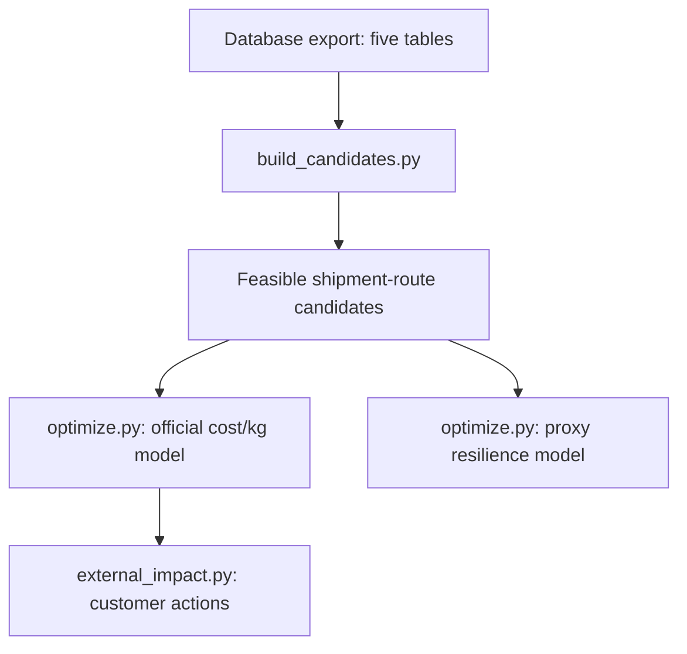

# Complete explanation of the optimiser

The optimiser has three main Python scripts:

1. `build_candidates.py` prepares all feasible shipment-route combinations.
2. `optimize.py` calculates the features, builds the PuLP model and selects routes.
3. `external_impact.py` converts the selected internal routes into delivery-level customer impacts.

There are two optimisation outputs:

- **Official model:** optimises the 40/40/20 MinScore using delivery-level cost/kg.
- **Proxy model:** optimises all 240 internal shipments using cost per piece for the resilience demonstration.



## 1. Input data

The optimiser uses five tables.

| Table | Purpose |
| --- | --- |
| `Internal_Shipments` | Internal shipment demand, quantity, stage, family and shipment date |
| `External Shipments` | External deliveries, chargeable weight and link to internal shipments |
| `Route_Options` | Available routes, lead time, cost, risk and capacity |
| `Hub_Constraints` | Hub capacity, utilization and handling capabilities |
| `Material_Families` | Hazard, temperature and priority requirements |

The Python scripts currently read an Excel workbook, not Supabase directly. When database data is used, it must first be exported into the required sheet and column structure.

The workbook path can be provided using:

```bash
IFX_WORKBOOK=/path/to/workbook.xlsx
```

If the database changes, the workbook must be exported again before rerunning the optimiser.

---

# Stage 1: `build_candidates.py`

## Purpose

This script converts the normalized source tables into a flat candidate table.

One candidate row represents:

> One internal shipment using one possible route.

It does not select the winning route. It only constructs and filters the available choices.

## Step 1.1: Load the tables

The `load_sheets()` function loads:

- `Internal_Shipments`
- `Material_Families`
- `Route_Options`
- `Hub_Constraints`

The external-delivery table is used later by `optimize.py`.

## Step 1.2: Clean material requirements

Missing `HazardClass` values are replaced with `"None"`:

```python
M["HazardClass"] = M["HazardClass"].fillna("None")
```

This means that a missing value is treated as having no special hazard-handling requirement.

## Step 1.3: Correct the percentage fields

The following hub fields contain decimal fractions:

- `CurrentUtilizationPct = 0.35` means 35%
- `MaxUtilizationPct = 0.90` means 90%
- `CapacityReductionPct = 0.25` means 25%

They are renamed to make this clear:

```text
CurrentUtilizationPct  -> current_utilization_ratio
MaxUtilizationPct      -> max_utilization_ratio
CapacityReductionPct   -> capacity_reduction_ratio
```

They are not divided by 100.

## Step 1.4: Calculate remaining hub capacity

For every hub:

$$\text{Capacity Ceiling} = \text{Weekly Capacity} \times \text{Maximum Utilization} \times (1 - \text{Capacity Reduction})$$

Current hub load is:

$$\text{Current Load} = \text{Weekly Capacity} \times \text{Current Utilization}$$

Remaining capacity is:

$$\text{Remaining Capacity} = \max(0,\ \text{Capacity Ceiling} - \text{Current Load})$$

In code:

```python
ceiling = WeeklyCapacityUnits * (
    max_utilization_ratio * (1 - capacity_reduction_ratio)
)
current_load = (
    WeeklyCapacityUnits * current_utilization_ratio
)
remaining_capacity_units = max(0, ceiling - current_load)
```

### Example

Suppose a hub has:

- Weekly capacity: 10,000 units
- Maximum utilization: 90%
- Current utilization: 50%
- Disruption reduction: 20%

Then:

$$\text{Ceiling} = 10{,}000 \times 0.9 \times (1 - 0.2) = 7{,}200$$

$$\text{Current Load} = 10{,}000 \times 0.5 = 5{,}000$$

$$\text{Remaining Capacity} = 7{,}200 - 5{,}000 = 2{,}200$$

The optimiser can therefore allocate another 2,200 units through this hub.

## Step 1.5: Join internal shipments to material requirements

The first join is:

```text
Internal_Shipments
        | MaterialNo_Anon
Material_Families
```

It adds:

- `HazardClass`
- `TempRequirement`
- `PriorityClass`

to every internal shipment. These fields determine whether the origin and destination hubs can handle the material.

## Step 1.6: Filter the route menu

The route table is filtered using:

```python
DisruptionScenario == active_scenario
AvailableFlag == "Yes"
```

The available scenarios are `Normal`, `PrimaryHubDown` and `AirCapacityReduced`.

For example, the Normal run only considers:

```text
DisruptionScenario = Normal
AvailableFlag = Yes
```

The scenario filter is applied only to `Route_Options`. The route and hub disruption columns are not joined because they represent different dimensions:

- Route scenario: overall network condition
- Hub disruption: local condition already attached to a specific hub

## Step 1.7: Join shipments to route options

The shipment-route join uses `MaterialFamily`, `StageFrom` and `StageTo`. Therefore a route is considered only when it:

1. Supports the shipment's material family.
2. Starts at the required production stage.
3. Ends at the required production stage.

This creates the unfiltered candidate table. For Normal, 1,137 shipment-route combinations are produced before handling checks.

## Step 1.8: Add origin and destination hub information

Each candidate is joined to `Hub_Constraints` twice:

```text
FromHub -> origin hub attributes
ToHub   -> destination hub attributes
```

The following fields are added for both hubs: remaining capacity, cold-chain availability, ESD handling, moisture control and lithium handling. The joins use only `HubID`.

## Step 1.9: Apply handling compatibility

The `_route_ok()` function checks whether both hubs can support the material.

### Temperature requirement

If `TempRequirement = Cold Chain`, then both origin and destination must have `ColdChainAvailable = Yes`.

### Hazard requirement

| Hazard class | Required hub capability |
| --- | --- |
| ESD Sensitive | `ESDHandlingAvailable` |
| Moisture Sensitive | `MoistureControlAvailable` |
| Lithium Handling | `LithiumHandlingAvailable` |
| None | No hazard capability required |

By default `ASSUME_BOTH_HUBS = True`, therefore both the origin and destination must qualify.

Under Normal, the resulting shipment feasibility breakdown is:

- 42 shipments with no compatible route
- 16 shipments with exactly one route
- 182 shipments with multiple routes

## Output of `build_candidates.py`

The script returns a candidate DataFrame to `optimize.py`. It does not need to write an intermediate Excel file. `optimize.py` imports the module and calls:

```python
sheets = build_candidates.load_sheets()
candidates = build_candidates.build_candidates(sheets, scenario)
feasible = build_candidates.apply_capability(candidates)
```

---

# Stage 2: `optimize.py`

## Purpose

This script:

1. Adds capacity features to every candidate.
2. Removes zero-capacity and excessive-horizon routes.
3. Calculates objective scores.
4. Builds the PuLP mixed-integer model.
5. Selects one route for each shipment.
6. Generates official and proxy workbooks.

There are two separate optimisation branches inside this script.

---

# Stage 2A: Common capacity calculations

These calculations are applied before both objective modes.

## Step 2A.1: Bottleneck capacity

A route can only process as much as its most restrictive resource.

$$\text{Bottleneck Capacity} = \min\left(\text{Route Capacity},\ \text{Origin Remaining Capacity},\ \text{Destination Remaining Capacity}\right)$$

In code:

```python
BottleneckCapacityPerWeek = min(
    CapacityUnitsPerWeek,
    orig_remaining_capacity_units,
    dest_remaining_capacity_units
)
```

If bottleneck capacity is zero or negative, the candidate is rejected. This prevents the optimiser from selecting a route through a hub with no remaining capacity.

## Step 2A.2: Weeks required

$$\text{WeeksRequired} = \left\lceil \frac{\text{Shipment Quantity}}{\text{Bottleneck Capacity Per Week}} \right\rceil$$

Example:

- Shipment quantity: 30,000 units
- Bottleneck capacity: 10,000 units/week

$$\text{WeeksRequired} = \lceil 30{,}000 / 10{,}000 \rceil = 3$$

## Step 2A.3: Multi-week indicator

```python
MultiWeek = WeeksRequired > 1
```

This identifies shipments that cannot be cleared within one week.

## Step 2A.4: Effective lead time

$$\text{EffectiveLeadTimeDays} = \text{BaseLeadTimeDays} + 7 \times (\text{WeeksRequired} - 1)$$

Example:

- Base route lead time: 4 days
- Weeks required: 3

$$4 + 7 \times (3 - 1) = 18 \text{ days}$$

Effective lead time is used for operational reporting, customer-impact warnings and expedite classification. It is not used in the official MinScore.

## Step 2A.5: Weekly footprint

$$\text{WeeklyFootprint} = \min(\text{Quantity},\ \text{Bottleneck Capacity})$$

The same footprint is charged to route capacity, origin hub capacity and destination hub capacity. This ensures that the same physical flow is represented at all three resources.

## Step 2A.6: Planning horizon

A shipment triggers capacity escalation when:

$$\text{WeeksRequired} > 12$$

Routes requiring more than 12 throughput weeks are removed from the normal candidate pool. Transit time is not included in the 12-week threshold. Therefore, a route may require exactly 12 throughput weeks and have an effective lead time of 85-88 days after transit is added.

## Step 2A.7: Shipment week

The shipment's `ShipDate` is converted into an ISO year-week:

```text
2026-01-05 -> 2026-W02
```

Capacity constraints are grouped by this week.

---

# Stage 2B: Official cost/kg optimiser

## Purpose

This is the model used for the hackathon's official 40/40/20 MinScore. It operates at two connected levels:

- 225 external delivery scores
- 132 shared internal route decisions

All 225 external deliveries link to 132 unique internal shipments. One internal shipment can support multiple external deliveries. Those deliveries must inherit the same internal route.

## Step 2B.1: Group deliveries by internal shipment

The `deliveries_by_shipment()` function creates a mapping:

```text
Internal Shipment
    -> Delivery 1 and its weight
    -> Delivery 2 and its weight
    -> Delivery 3 and its weight
```

For example:

```text
SIM-00001
    -> DEL_CX, 4 kg
    -> DEL_GH, 1 kg
```

## Step 2B.2: Expand each candidate to delivery grain

For every candidate route, `expand_deliveries()` creates one row for each linked delivery. If an internal shipment has 5 possible routes and 3 linked deliveries, the expansion produces:

$$5 \times 3 = 15$$

candidate-delivery score rows. However, there are still only five route decision variables. The delivery rows are used for scoring, not for capacity counting.

## Step 2B.3: Calculate delivery-level cost/kg

For delivery $d$ and candidate route $r$:

$$\text{CostPerKG}_{d,r} = \frac{\text{BaseCostEUR}_r}{\text{ChargeableWeightKG}_d}$$

The denominator is each delivery's individual weight. It is not:

- Total weight of all linked deliveries
- Internal shipment quantity
- Gross weight
- Number of pieces

This definition reproduces the dataset's `LowestCostPerKG_EUR` benchmark for all 225 deliveries.

### Example

Suppose:

- Candidate route cost: EUR 500
- Delivery A weight: 10 kg
- Delivery B weight: 100 kg

Then:

$$\text{Delivery A Cost/kg} = 500 / 10 = \text{EUR } 50/\text{kg}$$

$$\text{Delivery B Cost/kg} = 500 / 100 = \text{EUR } 5/\text{kg}$$

Both deliveries inherit the same route, but they have different cost/kg values.

## Step 2B.4: Fit one fixed normalization scaler

Lead time, cost/kg and risk use different units and ranges. They are normalized to the range 0-1:

$$\text{Normalized Value} = \frac{x - x_{\min}}{x_{\max} - x_{\min}}$$

The minimum and maximum values are fitted using the union of feasible candidate-delivery rows from Normal, PrimaryHubDown and AirCapacityReduced. The same bounds are then used for every scenario. This is important because fitting new bounds separately for each scenario would make the scenario scores incomparable.

## Step 2B.5: Calculate delivery MinScore

For every delivery-candidate combination:

$$\text{DeliveryMinScore}_{d,r} = 0.4\,L_{d,r} + 0.4\,C_{d,r} + 0.2\,R_{d,r}$$

where:

- $L$ = normalized `BaseLeadTimeDays`
- $C$ = normalized delivery-level `CostPerKG`
- $R$ = normalized `RiskScore`

Lower is better. The official score uses `BaseLeadTimeDays`, not `EffectiveLeadTimeDays`.

## Step 2B.6: Combine delivery scores into a route coefficient

One internal route decision can affect multiple deliveries. For a candidate route $r$ belonging to shipment $s$:

$$\text{Candidate Coefficient}_{s,r} = \sum_{d \in s} \text{DeliveryMinScore}_{d,r}$$

PuLP therefore sees one route coefficient containing the combined impact on all deliveries linked to that shipment. Minimizing the sum is equivalent to minimizing the overall average across 225 deliveries because 225 is a fixed denominator.

## Step 2B.7: Decision variables

### Route-selection variable

$$x_{s,r} = \begin{cases} 1 & \text{if shipment } s \text{ uses route } r \\ 0 & \text{otherwise} \end{cases}$$

### Unassigned variable

$$u_s = \begin{cases} 1 & \text{if shipment } s \text{ is unassigned} \\ 0 & \text{otherwise} \end{cases}$$

The unassigned variable prevents the complete model from becoming infeasible when a shipment has no usable route.

## Step 2B.8: Official objective function

$$\min \left[ \sum_{s}\sum_{r} \text{CandidateCoefficient}_{s,r}\, x_{s,r} + 10 \sum_s (\text{Number of Deliveries Linked to } s)\, u_s \right]$$

The unassigned penalty is applied per affected delivery. This strongly encourages PuLP to assign a route whenever a feasible one exists.

## Step 2B.9: Exactly-one-route constraint

For every internal shipment:

$$\sum_r x_{s,r} + u_s = 1$$

Therefore, each shipment must have exactly one selected route, or an unassigned status. Shipment splitting across multiple routes is not allowed.

## Step 2B.10: Route capacity constraint

For each route and shipment week:

$$\sum_{s} \text{WeeklyFootprint}_{s,r}\, x_{s,r} \leq \text{RouteCapacityPerWeek}_r$$

## Step 2B.11: Hub capacity constraint

For each hub and week:

$$\sum_{s,r\,:\,h \in r} \text{WeeklyFootprint}_{s,r}\, x_{s,r} \leq \text{RemainingHubCapacity}_h$$

Capacity is charged once per internal shipment. It is not multiplied by the number of external deliveries. If `FromHub == ToHub`, a Python set is used so the same hub is charged only once.

## Official outputs

`optimizer_official_costperkg.xlsx` contains:

### `Summary`

For each scenario: shipments routed, shipment universe, deliveries scored, total deliveries, average delivery MinScore, median, standard deviation, minimum and maximum.

### `DeliveryScores`

One row per served delivery containing: delivery number, internal shipment, selected route, delivery weight, base lead time, cost/kg, risk and delivery MinScore. Unserved deliveries are not included in this sheet.

### `RouteDecisions`

One row per selected internal route containing: shipment, route, origin and destination hub, mode, quantity, weeks required, multi-week flag, lead time, cost, risk and CO2.

## Latest official results

| Scenario | Internal shipments routed | Deliveries scored | Average MinScore |
| --- | ---: | ---: | ---: |
| Normal | 97/132 | 165/225 | 0.1516 |
| Primary Hub Down | 89/132 | 146/225 | 0.3457 |
| Air Capacity Reduced | 93/132 | 153/225 | 0.2976 |

---

# Stage 2C: Proxy resilience optimiser

## Purpose

Only 132 internal shipments have linked delivery weights. The remaining 108 do not have kilograms available. The proxy model therefore covers all 240 internal shipments using cost per piece instead of cost/kg.

This model supports the resilience and scenario-swap demonstration. Its score must not be presented as the official MinScore.

## Step 2C.1: Cost-per-piece proxy

$$\text{CostPerPiece}_{s,r} = \frac{\text{BaseCostEUR}_r}{\text{Qty}_s}$$

## Step 2C.2: Proxy score

$$\text{ProxyScore}_{s,r} = 0.4\,\text{norm(BaseLeadTimeDays)} + 0.4\,\text{norm(CostPerPiece)} + 0.2\,\text{norm(RiskScore)}$$

It has the same 40/40/20 structure but a different cost definition.

## Step 2C.3: Proxy objective

$$\min \left[ \sum_s\sum_r \text{ProxyScore}_{s,r}\, x_{s,r} + 10 \sum_s u_s \right]$$

The same route and hub capacity constraints are applied.

## Step 2C.4: Primary-route baseline

The baseline uses the same constrained solver, but restricts the candidate set to `IsPrimary = Yes`. This provides a fair comparison because both the optimizer and baseline face the same handling requirements, route capacity, hub capacity, 12-week horizon and unassigned penalty.

The model reports the optimizer solved count, baseline solved count, average score on their common served population, and the penalized all-shipment objective.

For disruption scenarios, no routes are marked as primary in the filtered route data. The correct interpretation is:

> No primary routes are marked available under this disruption scenario.

It should not automatically be described as the physical network collapsing.

## Step 2C.5: Unassigned-reason classification

Every unassigned shipment is placed into one of four groups:

- **Handling infeasible:** No route survives the cold-chain and hazard checks.
- **Zero capacity:** Handling-compatible routes exist, but all pass through a zero-capacity route or hub.
- **Capacity escalation:** Positive-capacity routes exist, but all require more than 12 throughput weeks.
- **Capacity contention:** A route is individually feasible, but shared weekly capacity is taken by other selected shipments.

## Proxy outputs

`optimizer_proxy_resilience.xlsx` contains `Summary`, `SelectedRoutes` and `Unassigned`.

## Latest proxy results

| Scenario | Routed shipments |
| --- | ---: |
| Normal | 167/240 |
| Primary Hub Down | 153/240 |
| Air Capacity Reduced | 160/240 |

---

# Stage 3: `external_impact.py`

## Purpose

This script creates the customer-facing delivery table. It does not optimize external airport or customer freight routes because the dataset does not contain an external route-option menu. Instead, it propagates the selected internal route to every linked customer delivery.

## Important handover

`external_impact.py` does not read `optimizer_official_costperkg.xlsx`. Instead, it imports `optimize.py` and reruns:

```python
solve_official_delivery()
```

using the same candidate logic, normalization, capacity rules, cost/kg calculation and official objective. It then maps each selected route to its linked external deliveries.

## Step 3.1: Match delivery to internal route

The join uses:

```text
External.InternalShipmentID_Link
        |
Official selected ShipmentID
```

All deliveries linked to the same internal shipment inherit the same route.

## Step 3.2: Recalculate delivery cost/kg

$$\text{CostPerKG} = \frac{\text{Selected Route Cost}}{\text{Individual Delivery Weight}}$$

This is the same definition used inside the official optimiser.

## Step 3.3: Add customer-impact fields

Each external delivery receives: selected route, origin hub, destination hub, base lead time, effective lead time, multi-week status, risk score, route cost, delivery weight, cost/kg, material priority, upstream failure reason and recommended action.

## Step 3.4: Expedite rule

A delivery is flagged for expedite when:

1. `PriorityClass` is `Critical` or `Expedite`.
2. The internal shipment is assigned.
3. `EffectiveLeadTimeDays >= 6`.

```python
expedite = (
    priority in {"critical", "expedite"}
    and assigned
    and EffectiveLeadTimeDays >= 6
)
```

The six-day threshold can be changed using:

```bash
python external_impact.py --expedite-lead-days 8
```

## Step 3.5: Action classification

| Condition | Action |
| --- | --- |
| No handling-compatible route | Blocked, notify customer |
| Only zero-capacity routes | Blocked, reroute upstream |
| More than 12 throughput weeks | Capacity escalation required |
| Shared capacity unavailable | Capacity contention, reschedule |
| High-priority and slow | Expedite |
| Otherwise | Standard flow |

The output is `external_impact.xlsx`.

---

# How the scripts hand information to one another

| Script | Receives | Produces | Used by |
| --- | --- | --- | --- |
| `build_candidates.py` | Source workbook | Candidate DataFrames and cleaned table dictionary | `optimize.py` |
| `optimize.py` | Candidate functions and source tables | Official and proxy route decisions | `external_impact.py` |
| `external_impact.py` | Official solver functions and external deliveries | Customer-impact workbook | Dashboard/presentation |

The handover is primarily through imported Python functions and pandas DataFrames, not intermediate CSV files.

---

# Features used by the optimiser

## Used directly in the official objective

| Feature | Calculation |
| --- | --- |
| Lead time | `BaseLeadTimeDays` |
| Cost/kg | `BaseCostEUR / individual ChargeableWeight_KG` |
| Risk | `RiskScore` |
| Final score | `0.4 lead + 0.4 cost/kg + 0.2 risk`, after normalization |

## Used as feasibility constraints

`Qty`, `CapacityUnitsPerWeek`, `WeeklyCapacityUnits`, current utilization, maximum utilization, capacity reduction, cold-chain availability, hazard-handling flags, route scenario, route availability, shipment date and the 12-week throughput horizon.

## Used for reporting or classification

`EffectiveLeadTimeDays`, `WeeksRequired`, `MultiWeek`, `CO2Kg`, `TransportMode`, `PriorityClass`, `IsPrimary`, customer country and destination airport.

## Not currently included in the objective

CO2 emissions, fixed hub handling cost, variable hub handling cost, item value, actual arrival, historical transit delay, shipment status, customer priority and effective lead time.

The precomputed fields such as `LowestCostPerKG_EUR`, `BestLeadTimeDays` and `LowestRiskScore` are used for validation, not as decision inputs.

---

# Important modelling assumptions

1. Both origin and destination hubs must support the material.
2. One shipment uses exactly one route; splitting is not allowed.
3. The official score covers 225 deliveries linked to 132 internal shipments.
4. The proxy score covers all 240 internal shipments.
5. Min-max bounds are fitted across all scenarios, not separately.
6. Local hub disruptions and network route scenarios are treated as separate dimensions.
7. Shipments requiring more than 12 throughput weeks are escalated.
8. Capacity is enforced by ISO shipment week.

## Remaining capacity limitation

The current model is still a throughput approximation. A shipment requiring five weeks is charged one bottleneck-sized footprint in its shipment week. It is not explicitly scheduled across five future weekly periods.

A full production model would use variables such as:

$$f_{s,r,w}$$

representing how much of shipment $s$ moves through route $r$ during week $w$. That would ensure that multi-week shipments occupy capacity in every week they are processed.

---

# Important note for the technical handover

`optimize.py` still contains older aggregate-weight helper functions from previous versions. The active official execution path is:

```text
deliveries_by_shipment()
-> fit_scaler_delivery()
-> solve_official_delivery()
-> run_official_delivery()
```

The active proxy path is:

```text
fit_scaler()
-> run_scenario()
-> solve()
-> run_objective("piece")
```

Do not call the older generic `"kg"` path. It uses the previous shipment-level aggregation approach and is not the final official model.

## One-sentence explanation

> The system first generates handling-compatible shipment-route candidates, calculates route and hub capacity feasibility, and then uses PuLP to select one route per internal shipment that minimizes a normalized 40% lead-time, 40% delivery-level cost/kg and 20% risk score, before propagating the selected upstream route to each affected customer delivery.

---

# Disruption scenarios

Disruption scenarios must be considered in both the separate internal and external optimisers.

The optimiser should run three separate times:

1. `Normal`
2. `PrimaryHubDown`
3. `AirCapacityReduced`

Each run generates a different candidate-route pool and potentially different selected routes.

## Where disruption scenarios come from

There are two separate disruption concepts in the data.

### 1. Network disruption scenario

This is stored in:

```text
route_options.disruption_scenario
```

Its values are `Normal`, `PrimaryHubDown` and `AirCapacityReduced`. This controls which route-option rows are considered during each optimisation run.

### 2. Local hub disruption

This is stored in:

```text
hub_constraints.disruption_scenario
```

Its values include Port congestion, Labour shortage, Weather disruption and None. This describes a local condition affecting one specific hub.

These two columns should not be joined together because they describe different disruption levels:

```text
Route scenario = overall network condition
Hub scenario   = local event affecting one facility
```

## Important clarification about `internal_shipments.scenario`

The `scenario` column in `internal_shipments` contains values such as:

```text
FE_to_SIFO
OSAT_to_OSAT
Backend_to_OSAT
```

This is not a disruption scenario. It describes the shipment's movement type. Therefore, do not filter internal shipments using:

```python
internal_shipments["Scenario"] == "Normal"
```

That would be incorrect. The active disruption scenario is applied to `route_options`.

## How the scenario changes candidate routes

For each scenario, the optimiser filters:

```python
route_options[
    (DisruptionScenario == active_scenario)
    & (AvailableFlag == True)
]
```

### Normal

```python
DisruptionScenario == "Normal"
AvailableFlag == True
```

The model sees routes available during normal operations, including primary and alternative routes.

### Primary Hub Down

```python
DisruptionScenario == "PrimaryHubDown"
AvailableFlag == True
```

The model only sees routes designed for the primary-hub-down situation. Routes that depend on the unavailable primary hub are either absent from this scenario, marked unavailable, or replaced by alternative-hub routes.

### Air Capacity Reduced

```python
DisruptionScenario == "AirCapacityReduced"
AvailableFlag == True
```

The model sees the route options available when air capacity is reduced. These routes may have different transport modes, capacities, lead times, costs and risk scores.

## How disruptions affect capacity

The local hub capacity calculation is:

$$\text{Remaining Hub Capacity} = \max\left(0,\ W\left[M(1 - D) - U\right]\right)$$

where:

- $W$ = weekly hub capacity
- $M$ = maximum utilisation ratio
- $D$ = capacity reduction ratio
- $U$ = current utilisation ratio

### Example without disruption

Suppose weekly capacity = 10,000, maximum utilisation = 90%, current utilisation = 50%, capacity reduction = 0%:

$$10{,}000 \times [0.9(1 - 0) - 0.5] = 4{,}000$$

The hub has 4,000 remaining units.

### Example with a 25% reduction

$$10{,}000 \times [0.9(1 - 0.25) - 0.5] = 10{,}000 \times (0.675 - 0.5) = 1{,}750$$

The same hub now has only 1,750 remaining units. This lower capacity affects the route bottleneck.

## How disruptions affect the route bottleneck

For every candidate route:

$$\text{Bottleneck} = \min\left(\text{Route Capacity},\ \text{Origin Remaining Capacity},\ \text{Destination Remaining Capacity}\right)$$

A disruption may reduce the route's own weekly capacity, origin-hub capacity or destination-hub capacity. This increases the time required to clear the shipment:

$$\text{WeeksRequired} = \left\lceil \frac{\text{Demand Quantity}}{\text{Bottleneck}} \right\rceil$$

If $\text{WeeksRequired} > 12$ the candidate is classified as:

```text
CAPACITY ESCALATION REQUIRED
```

If the bottleneck is zero, the candidate is rejected.

## How disruptions affect the score

The score formula remains:

$$\text{Score} = 0.4(\text{normalised lead time}) + 0.4(\text{normalised cost}) + 0.2(\text{normalised risk})$$

However, the route values can change between scenarios. For example:

| Feature | Normal route | Disrupted route |
| --- | ---: | ---: |
| Lead time | 3 days | 8 days |
| Cost | EUR 300 | EUR 450 |
| Risk | 1.5 | 3.2 |
| Capacity | 15,000/week | 9,000/week |

The disruption route will generally have higher normalized lead time, higher normalized cost, higher normalized risk, more weeks required, and a greater chance of capacity escalation. The optimiser then searches for another route that offers the lowest feasible score under the disrupted condition.

## Internal optimiser under disruption

For each internal shipment:

1. Keep the same shipment demand and requirements.
2. Load route options for the active disruption scenario.
3. Remove unavailable routes.
4. Check hazard and cold-chain requirements.
5. Recalculate route and hub capacity.
6. Remove zero-capacity routes.
7. Remove routes requiring more than 12 weeks.
8. Recalculate every candidate score.
9. Select the lowest-scoring globally feasible route.

The internal cost term remains either `BaseCostEUR` or the benchmark-confirmed internal cost definition.

## External optimiser under disruption

For every external delivery:

1. Keep its chargeable weight, pieces and material requirements.
2. Load routes for the active disruption scenario.
3. Remove unavailable routes.
4. Check hub handling requirements.
5. Recalculate capacity using `Pieces`.
6. Calculate delivery-level cost/kg:

$$\text{CostPerKG} = \frac{\text{Scenario Route Cost}}{\text{Individual Delivery Weight}}$$

7. Calculate the scenario-specific MinScore.
8. Select the best feasible route for that delivery.

The external optimiser remains independent from the internal optimiser.

## Normalisation across scenarios

This part is critical. Do not normalize each scenario separately. Instead:

1. Collect all feasible candidates from all three scenarios.
2. Find one global minimum and maximum for each metric.
3. Reuse those bounds for every scenario.

For internal shipments:

```text
One fixed internal scaler
```

For external shipments:

```text
One fixed external scaler
```

This ensures that a score of 0.30 under disruption can be meaningfully compared with 0.15 under Normal. If each scenario were normalized independently, even poor disrupted routes could appear to have low scores because they would be compared only with other poor disrupted routes.

## Expected disruption outputs

Each optimiser should report:

| Metric | Purpose |
| --- | --- |
| Shipments routed | Number with feasible selected routes |
| Unassigned | Number without selected routes |
| Average MinScore | Average quality of selected routes |
| Handling infeasible | No compatible hubs |
| Zero capacity | All compatible routes have no capacity |
| Capacity escalation | All routes need more than 12 weeks |
| Capacity contention | Individually feasible but shared capacity unavailable |
| Mode changes | For example, air changed to road or ocean |
| Primary routes retained | How many continue using primary routes |
| Alternative routes selected | Number rerouted |

## Simple interpretation

Under Normal:

> The optimiser chooses the lowest-scoring feasible route from the normal route network.

Under Primary Hub Down:

> Routes using the affected primary network are removed or unavailable, so the optimiser selects alternative hubs and recalculates capacity, cost, lead time and risk.

Under Air Capacity Reduced:

> Lower air-route capacity increases the bottleneck and weeks required, potentially causing the optimiser to switch deliveries to road or ocean routes.

## Recommended code structure

Both independent optimiser functions should receive the scenario explicitly:

```python
run_internal_optimizer(
    scenario="Normal"
)
run_external_optimizer(
    scenario="Normal"
)
```

Then repeat:

```python
for scenario in [
    "Normal",
    "PrimaryHubDown",
    "AirCapacityReduced"
]:
    run_internal_optimizer(scenario)
    run_external_optimizer(scenario)
```

This produces six baseline results:

```text
Internal x Normal
Internal x PrimaryHubDown
Internal x AirCapacityReduced
External x Normal
External x PrimaryHubDown
External x AirCapacityReduced
```

The combined extension can then run the same three scenarios separately.

The short answer is:

> Disruptions change the available route menu, route characteristics and remaining capacity. The optimiser recalculates feasibility and MinScore for every candidate, then reroutes each shipment or flags it as unassigned or requiring capacity escalation.
